# Tasky

<div align="center">
  **English** · **[العربية](README.ar.md)**
</div>

<p align="center">
  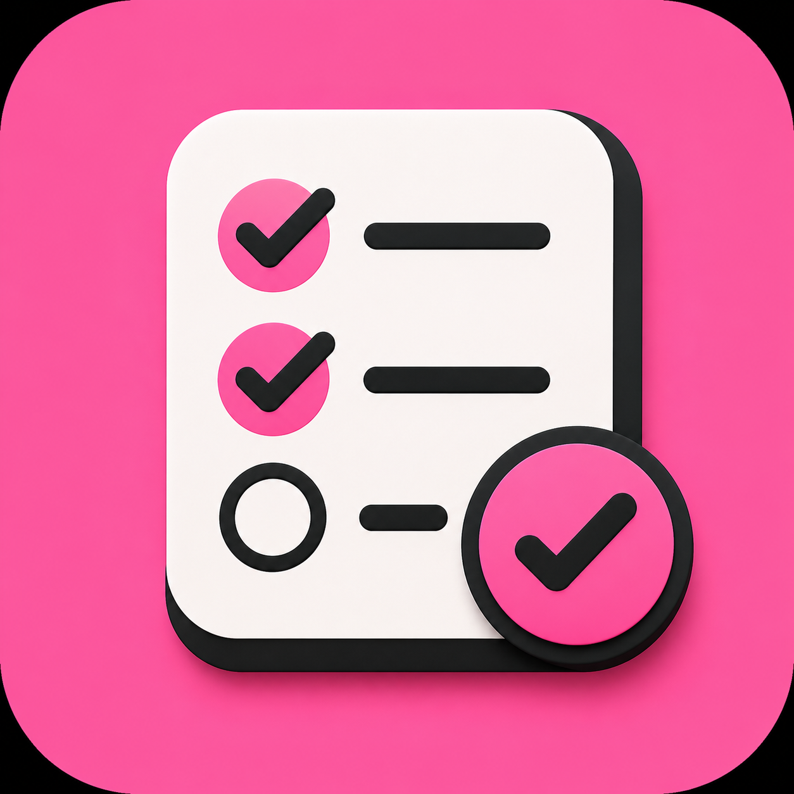
</p>

<p align="center">
  <b>Folders. Tasks. Your vibe.</b><br/>
  A colorful Flutter todo app with onboarding, themed folders, swipe actions, and local persistence.
</p>

<p align="center">
  
  
  
  
</p>

---

## Why this exists

Todo apps don’t need a backend to feel premium.

Tasky is a fully offline Flutter client with a polished onboarding funnel, per-user theme color + dark mode, folder-based organization, and a centralized `AppState` that auto-persists to `shared_preferences`.

## Features

| Area | What you get |
|------|----------------|
| Onboarding | Welcome → theme color → name → avatar |
| Folders | Create tagged folders to group work |
| Tasks | Add, complete, swipe-to-delete |
| Personalization | Seed-color theme, light/dark toggle, avatar swap |
| Persistence | Profile, folders, and tasks saved locally |
| Motion | Lottie accents, page transitions, draggable home header |
| Branding | Custom launcher icon + splash from `assets/logo.png` |

## User flow

```text
Welcome screens
  → Pick favorite color (+ dark mode)
  → Enter name
  → Choose avatar
  → Home: folders + FAB
  → Open folder → manage tasks
  → Settings: profile / theme / reset onboarding
```

## Demo

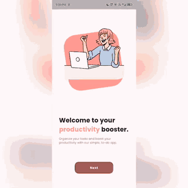

## Screenshots

### Onboarding
<table>
  <tr>
    <td align="center">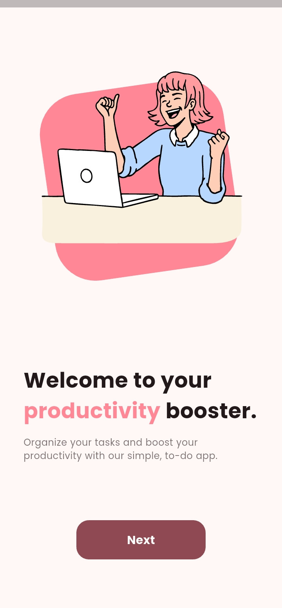</td>
    <td align="center">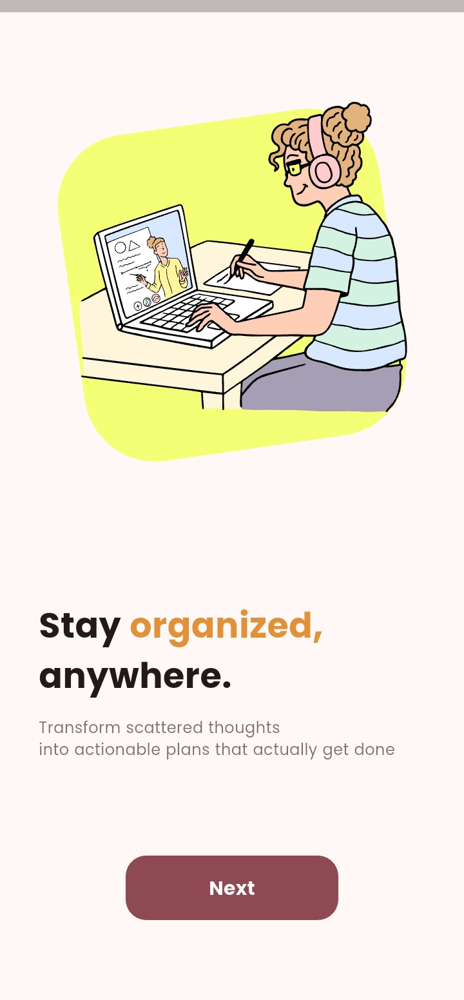</td>
    <td align="center">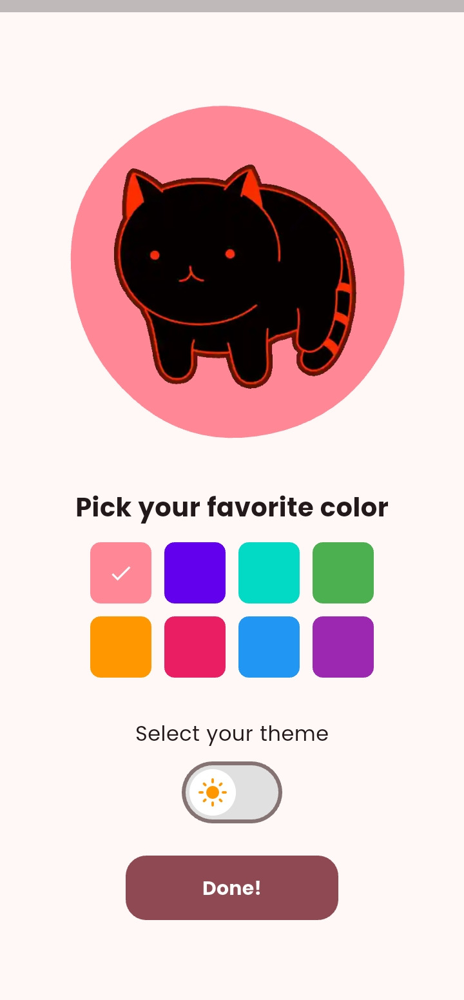</td>
    <td align="center">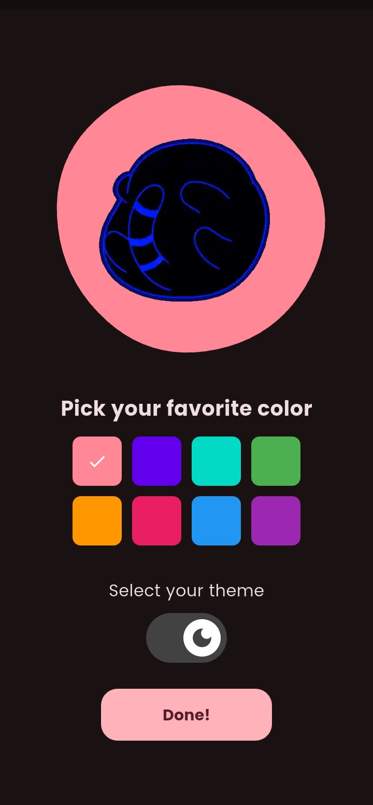</td>
  </tr>
  <tr>
    <td align="center">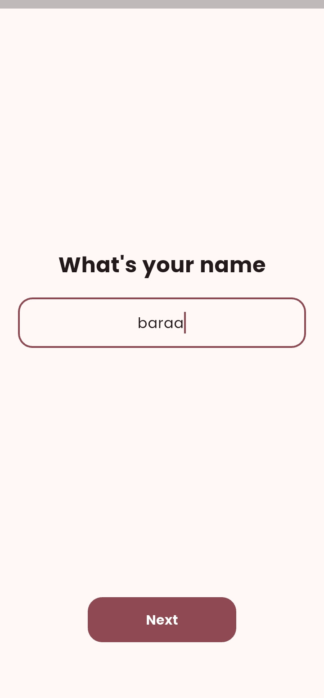</td>
    <td align="center">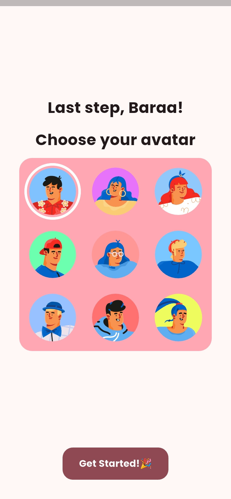</td>
  </tr>
</table>

### Home & tasks
<table>
  <tr>
    <td align="center">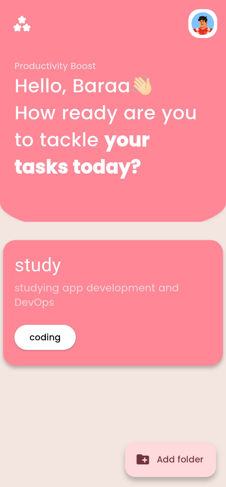</td>
    <td align="center">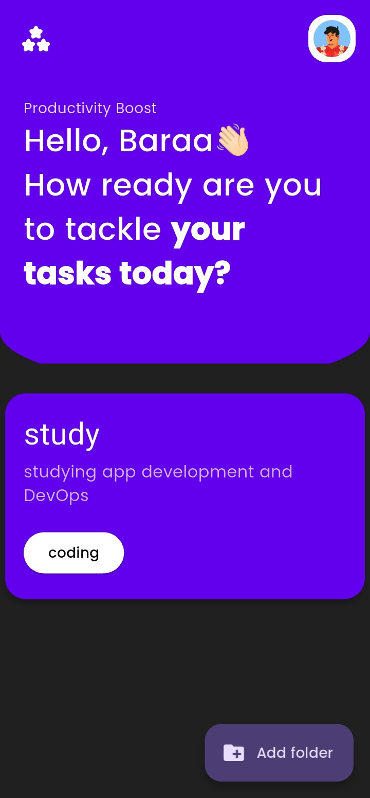</td>
    <td align="center">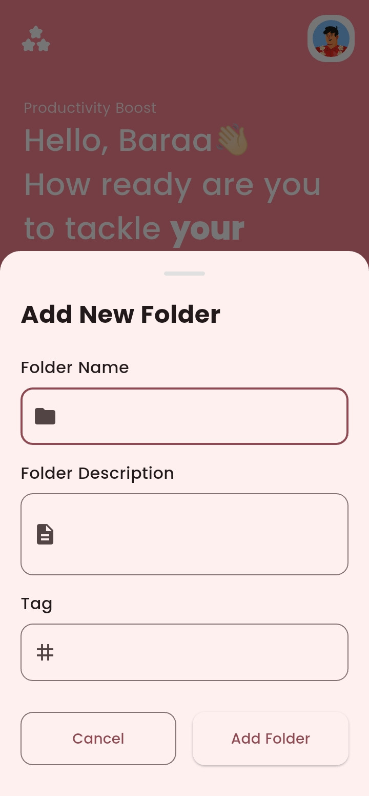</td>
    <td align="center">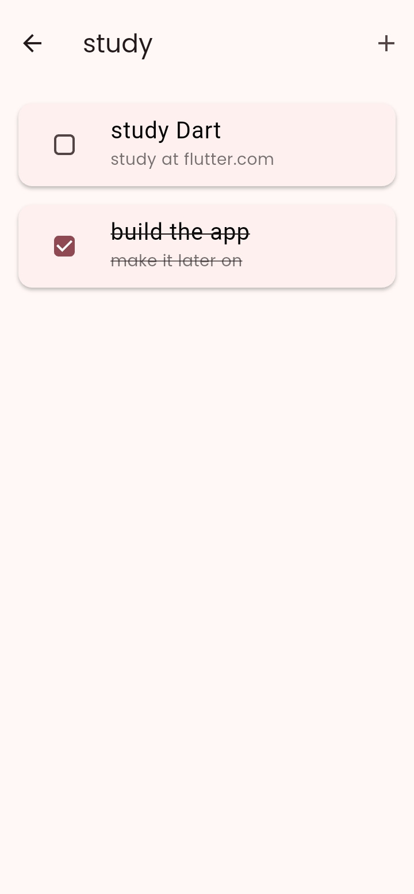</td>
  </tr>
</table>

## Architecture

```text
┌──────────────────┐     ┌─────────────────────┐     ┌──────────────────┐
│  Features / UI   │ ──▶ │  AppState           │ ──▶ │  LocalStorage    │
│  onboarding      │     │  ValueNotifiers     │     │  shared_prefs    │
│  home · settings │     │  folders · profile  │     │  JSON folders    │
└──────────────────┘     └─────────────────────┘     └──────────────────┘
```

**Separation of concerns**
- `features/` — screens & feature widgets (onboarding, home, settings)
- `core/state` — `AppState` with `ValueNotifier`s + auto-save listeners
- `core/storage` — `LocalStorage` wrapping `shared_preferences`
- `core/models` — `Folder` · `Task`
- `shared/widgets` — color picker, avatar selector, theme toggle

## Project structure

```text
lib/
├── main.dart                 # bootstrap — load AppState, run app
├── app.dart                  # MaterialApp + dynamic ColorScheme
├── core/
│   ├── constants/            # colors, assets, strings
│   ├── models/               # Task, Folder
│   ├── state/                # AppState (notifiers + persistence hooks)
│   └── storage/              # LocalStorage
├── features/
│   ├── onboarding/           # welcome → theme → name → avatar
│   ├── home/                 # folders, tasks, FAB, header
│   └── settings/             # profile, theme, reset onboarding
└── shared/widgets/           # reusable personalization controls

assets/                       # logo, avatars, lotties, Poppins, SVGs
showcase/                     # screenshots + demo video
```

## Tech stack

| Layer | Choice |
|-------|--------|
| Framework | Flutter · Dart `^3.8.1` · Material 3 |
| State | `ValueNotifier` + centralized `AppState` |
| Persistence | `shared_preferences` |
| Fonts | Bundled Poppins · `google_fonts` accents |
| Motion | `lottie` · `page_transition` · `draggable_home` · `animations` |
| UI extras | `flex_color_picker` · `google_nav_bar` · `blobs` · SVG avatars |

Full list: [`pubspec.yaml`](pubspec.yaml)

## Getting started

**Prerequisites**
- Flutter SDK (3.8+)
- Android SDK / emulator or device

```bash
git clone https://github.com/baraa404/Tasky.git
cd Tasky
flutter pub get
flutter run
```

### Icon & splash

```bash
dart run flutter_launcher_icons
dart run flutter_native_splash:create
```

## Notes for reviewers

- Package name in `pubspec.yaml` is `todoapp`; product branding is **Tasky**.
- Fully offline — no auth, no backend.
- Theme seed defaults to a warm pink (`#ff8796` / splash `#FC579D`) until the user picks a color.

## License

Personal / portfolio project — use and modify as you like.
